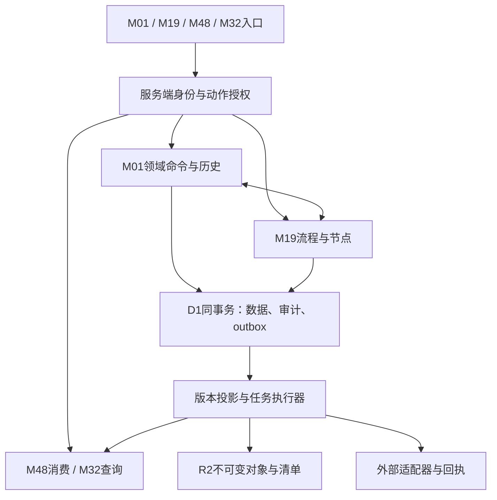

# R1 P2总体架构与复用边界

任务：R1-P2-01。状态：设计完成，待独立评审；不是P2批准或P3验证。

## 批准依据与版本

基准源码/事实源：`716cd9df5f5776d050f77f57c2ad5a35c0a83882`。批准需求：`R1-P1-P2-TRANSITION-20260909`、`R1-BASELINE-01`、`BASE-01`、`BASE-02`、`BASE-03`、`BASE-04`、`BASE-05`、`BASE-06`、`E1`、`E2`。批准原文及优先级以 [批准记录](../P1_Approval_Records.md) 为准；原文中的历史待批措辞不重开已批准决定。

## 当前实现与复用判定

- **可复用**：[当前成员与一致读取](../../../lib/hris/context.ts)；基准文件 SHA-256 `2a2fd5162c44c61cfb8c703d6efc5e7c30e86ec3f4885ce2becb56b1dcac3a45`。身份、成员再读取和补充读取revision检查保留；需扩展授权修订与恢复隔离闸门。
- **待修改**：[核心事务](../../../lib/hris/repository.ts)；基准文件 SHA-256 `d29c455ce153d7231728c7821d3571ad92ae60edf6b1811d478dcb6a2f1a1249`。单租户workspace CAS与last_mutation门控可复用；当前全量装载不能作为目标有界查询。
- **可复用**：[扩展事务](../../../lib/hris/development-repository.ts)；基准文件 SHA-256 `b0bc2b0cd3490358d0e43d90f8b8f9f0e338a7141672da3dab28efe469a6fd1d`。commitExtension与不可变事件快照保留；当前跨域一次性读取不能支撑大任务。
- **受限**：[现有托管声明](../../../.openai/hosting.json)；基准文件 SHA-256 `69fbe98861d2790d2d029fca25d257b8bd8b031777e3e164485a60ca69a12638`。仅确认DB/BUCKET和现Site标识存在，未证明独立调度、云端备份导出或恢复权限。

## 设计目标与主事实源边界

R1保留M01组织/职务体系/编制/人员/任职/合同，M19流程管理/管理员委托，M48全部七项消费，M32全部六域报表及BASE-01至06。原48、当前15和33暂缓不变；M03/M06/M17/M18/M26/M37/M12/M16/M27/M11/M07仅生产者契约依赖，不在R1实现其业务引擎。治理看板不可用不影响产品事务；本目录不得被当作新的模块完成率来源。

需求优先级：本次用户授权边界 → P1批准记录中的明确规则 → 被批准其余规格 → 静态实现事实 → 未证原站线索。旧F01–F04“离职立即生效”“任意历史终止调动强关联”等描述与F-SPEC-03/05冲突时登记差异，不覆写批准需求或原历史文件。

## 组件、对象与数据流

D1仍是业务事实唯一持久层，R2仍存不可变附件/快照/导出块；后台执行器只消费D1已提交outbox和job，不把队列当业务事实。Vinext/Sites、既有路由和逻辑绑定保持。P3新增实现为增量表、服务端适配与有界投影，避免替换全站框架。图中执行器与新增表均为设计，并未创建服务。

| 责任边界 | 拥有对象/操作 | 下游只消费 | 禁止隐含副作用 |
|---|---|---|---|
| M01 | person、employment、assignment、catalogVersion、legalEntity、contract、workforcePlan | 稳定ID、实际生效、有效区间、授权安全投影 | 建人不开户；重聘不复权；合同登记不真实签署 |
| M19 | templateVersion、instance、node、decision、delegation | 原单及申请版本、业务适配结果 | 管理权不等审批权；已生效业务不被撤销擦除 |
| M48 | 入口映射及短期投影；业务记录归原域 | allowedActions与映射版本 | 不另存可修改“任务完成状态”；不发明OKR评分 |
| M32 | datasetDefinition、snapshot、exportJob、subscription、delivery | 生产者已批准字段、主键、单位、状态 | 不把人数/任务/引用相加；不恢复暂缓模块 |
| BASE | 身份/授权版本、审计、attachmentRef、outbox/inbox、recoveryManifest | 最小基础结构 | 无供应商配置不真调用；E2不增加人 |

## 统一键、版本与事务不变量

1. 所有新表主键、外键含tenant_id；稳定业务ID不复用，显示编码/名称不能作为跨域连接键。personId沿现employee.id保留，platform userId和memberId绝不替代人员身份。
2. workspaceRevision为租户一致提交序号；entityRevision为单对象修订；definitionVersion为不可变规则版本；schemaVersion为存储结构版本；authorizationRevision为当前权限/绑定/关系变化序号。分别传递，不能互换。初期业务写仍串行租户CAS；高并发分片须另作性能评估，不破坏原子性。
3. 领域命令先校验当前身份/动作/对象/组织/字段/历史交集、输入版本，再在同一D1 batch门控下写事实、不可变事件、审计、outbox与幂等回执。所有语句受同一个成功CAS token约束；CAS零行不写后续数据；任一语句失败全事务回滚。异步工作不在该事务里发消息/上传文件。
4. 授权变更与业务数据变化必须递增对应版本，并由事务最终WHERE同时核当前角色/授权修订/委托有效期及恢复epoch。只比role相等不充分：同role缩组织或撤字段也必须挡住旧提交。
5. 业务审批、业务生效和通知投递三个状态域分开；结果未知是客户端/外部观察状态，不能把未知当数据库已写failed。禁止捕获存储异常后返回成功。
6. 不可变事件含eventId、entityId、entityRevision、workspaceRevision、correlationId、causationId、digest、actor及业务日期/实际发生时刻；事件禁止持有完整敏感人事载荷，消费者按当前权取投影。

## 复用、修改、新增、受限清单

| 分类 | 具体处置 | 替代方案及取舍 |
|---|---|---|
| 可复用 | 当前身份SDK、租户隔离、CAS/batch、D7两级校验、CSV文本安全、历史审计和附件10MiB类型边界 | 保留当前路径，避免另建认证或流程平行实现 |
| 待修改 | readWorkspace全量读取、single org/job、role单值、字段布尔开关、报表日期静默忽略、self-service旧缓存 | 有界读接口和显式多关系/动作映射；旧接口兼容只读不能泄漏新字段 |
| 待新增 | 目录/任职版本、通用流程实例与管理委托、权限集合、分页投影、声明式设计器、异步job/outbox、恢复manifest | 不能用全量JSON或定时页面请求伪装后台能力 |
| 受限 | 原站CDP既有超时、真实多人、R2/R3生产者、供应商、Sites托管备份/调度能力 | 定向补证/合成契约/P4安排；不阻静态设计，也不标运行通过 |

## 部署与容量设计边界

托管Worker每isolate 128MB（Sites环境说明）；R1目标查询必须有界，禁止在请求内读全租户再截断。设计预算：单页50行，内部最大200行，导出单块≤4MiB且按行/字节双限，任务租约可续且有fencing token；这些技术上限可在P3实测后收紧，不减少业务可查询总量。大数据通过cursor/job完整遍历。

不假设Sites已开放Cron、Queue、D1 Time Travel或备份API。第08任务给出平台能力核验、外部受控执行备选、容量公式、成本和责任，任何未接通能力在P3任务中显式列依赖。业务调动和其他批准要求HR执行的生效不交给自动job偷偷执行；job可建立“到期可办理”提示。

## 版本与历史证据

启动主仓库main HEAD为716cd9d，干净；独立工作树从此提交新建，未回退交接历史HEAD。启动输入及内容哈希见[R1_P2_Source_Manifest.json](R1_P2_Source_Manifest.json)。历史验收文档只证明原版本；例如D1–D7历史测试源码3d690cbbd6336c6de8b76a06fa4459700b1e3a88，云端恢复与独立多人尚未验证。所有历史JSON原样保留。

## 正常与失败场景及P3建议

以下仅为可执行验收设计，全部未运行。P3须在P2退出获批后使用隔离合成数据；P4独立人类角色和生产验收不由本表替代。

### P3-ARC-01

- 需求：BASE-01、BASE-02、BASE-03。
- 给定：有效平台身份、active成员，A范围可见；读取后同role被撤字段/缩范围
- 操作：带旧authorizationRevision提交命令
- 预期：拒绝旧权提交；业务、审计成功事件和outbox都不产生部分提交；新读取只返回当前交集
- 证据产物：角色/授权revision前后及D1事务行差分
- 责任：R1 P3实施及测试负责人；关闭闸门：P3该任务验收；状态：未执行。

### P3-ARC-02

- 需求：R1-BASELINE-01、BASE-04、BASE-05、BASE-06。
- 给定：有效命令准备数据/审计/outbox，同一token；对象服务不可用
- 操作：注入审计失败，再以新命令正常提交
- 预期：失败全回滚；正常仅一次业务变化，外部/对象失败不伪造业务成功外效；恢复保持隔离
- 证据产物：SQL执行计划、不可变事件和独立对象状态
- 责任：R1 P3实施及测试负责人；关闭闸门：P3该任务验收；状态：未执行。

### P4-ARC-03

- 需求：E1、E2、R1-P1-P2-TRANSITION-20260909。
- 给定：独立评审人持设计包，当前E2仅所有者
- 操作：审查P2范围与角色验收安排
- 预期：页面可开仅E1；P2退出需所有者显式批准，真人多角色需后续授权，不能单管理员代替
- 证据产物：独立评审记录与授权记录
- 责任：项目所有者/独立验收负责人；关闭闸门：P2退出评审及P4权限验收；状态：未执行。

## 全包一致性补充

本任务随最终评审补齐的字段、状态、旧验收优先级和迁移边界，统一见[R1_P2_Consistency_Resolutions.md](R1_P2_Consistency_Resolutions.md)。这些是设计自检修正，不重开P1批准或重做任务。

## 本阶段执行边界

本任务只修改P2设计及一致性材料；未运行产品测试、迁移、备份恢复、外部交易或原站操作；不改变业务代码、数据库、部署、访问者及主事实源。所有技术默认均为设计参数，不能覆盖已批准业务规则。
