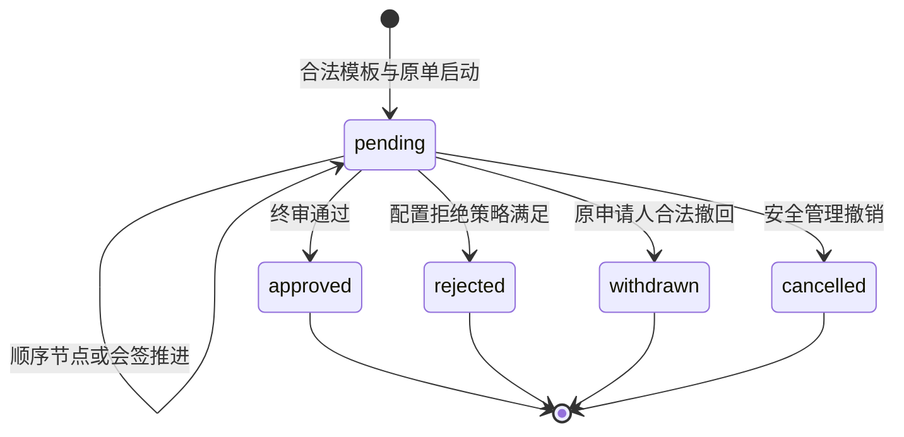

# M19流程、委托与业务一致性设计

任务：R1-P2-03。状态：设计完成，待独立评审；不是P2批准或P3验证。

## 批准依据与版本

基准源码/事实源：`716cd9df5f5776d050f77f57c2ad5a35c0a83882`。批准需求：`M19-SPEC-01`、`M19-SPEC-02`、`M19-SPEC-03`、`M19-SPEC-04`、`BP-I-REQ-07`、`D7`、`BASE-03`。批准原文及优先级以 [批准记录](../P1_Approval_Records.md) 为准；原文中的历史待批措辞不重开已批准决定。

## 当前实现与复用判定

- **待修改**：[现有三类人事workflow](../../../lib/hris/model.ts)；基准文件 SHA-256 `0261ebfe42dc0227d7889b9bb4e190f0e4b120d86c9b0093fd497d1b1b7a9480`。已冻结有序steps/version但没有通用分支/会签/委托；迁移必须保存旧已办结论。
- **可复用**：[待办投影](../../../lib/hris/work-inbox.ts)；基准文件 SHA-256 `5761147a08f5fb56ddd54acb2e1ae019a5ddf46decea3cce7b791a76138780c0`。原域资格与原记录链接可复用；现人事只遍历pending，必须另提供waiting/failed执行清单。
- **可复用**：[同事务扩展](../../../lib/hris/development-repository.ts)；基准文件 SHA-256 `b0bc2b0cd3490358d0e43d90f8b8f9f0e338a7141672da3dab28efe469a6fd1d`。CAS门控可承载流程与领域适配原子提交，不能在事务内调用外部网络。
- **待修改**：[人事入口](../../../app/api/hris/route.ts)；基准文件 SHA-256 `87424792fc3a73aceb1437820bdd0d9448827e3e248c76f86857eab7341cd95c`。保持D7入口与后端约束；新的通用动作必须显式拒绝transfer类型。

## 流程对象、模板发布与冻结

| 对象 | 主键/字段 | 约束 |
|---|---|---|
| workflowTemplateVersion | tenant/templateId/version；businessType、adapterVersion、schemaVersion、nodeDefinitions、expressionAST、digest、status | draft→published→retired；published不可变，停用仅阻新实例 |
| workflowInstance | tenant/instanceId；businessType/businessId/applicationVersion、templateId/version、initiatorMemberId/personId、entityRevision、approvalStatus、effectStatus、effectVersion | UNIQUE(tenant,businessType,businessId,applicationVersion)；同键不同digest冲突；无模板不创建成功实例 |
| nodeExecution | instanceId/nodeId/nodeRevision、generation、status、resolvedAssigneeIds、frozenPolicy、decisionSeq | assignee集合在节点激活时记录解析依据与授权修订；提交时再验当前资格，不能用冻结资格保永久权 |
| nodeDecision | decisionId、nodeExecutionId、actualActorId、decision、reason、at、commandId、digest | immutable；同(actor,nodeRevision)只一次有效决定；历史人名和决定不被转交改写 |
| managementEvent | eventId、action、from/to节点/人员、reason、delegationId、operatorId、before/afterRevision | 与动作同事务；跳过标skipped_by_intervention，不伪写approved |
| adminDelegation | delegationId、principalId、delegateId、actions、businessTypes、orgScope、fieldAllowlist、startAt/endAt、acceptedAt、revision、status/revokeReason | 双方已有active成员；禁自委托/转委托；同双方同管理范围有效期不重叠 |
| notificationEvent | eventId、instanceId/nodeRevision、recipientId、templateVersion、payloadDigest、channel、status、attempt、providerReceiptId | pending/sent/failed/unknown/invalidated；不等已读/业务生效 |

模板发布校验：节点ID唯一、入口/终点完整、图无环、全部节点可达、每条分支有声明字段/类型/运算符、会签all/any和拒绝策略完整。仅允许类型化AST中的eq/ne/in/gt/gte/lt/lte/and/or/not以及经声明的空值判断，禁止脚本、SQL、任意字段路径。静态校验尽可能识别重叠条件；运行时必须恰好一条分支命中，0条NO_ROUTE、>1条AMBIGUOUS_ROUTE。不能用节点顺序悄悄决定优先级，也不能“无路由自动通过”。空值参与比较返回unknown，仅显式isNull匹配；缺字段阻路由并返回可核reasonCode。

启动事务冻结模板、原单申请版本和分支输入摘要；已运行实例不随v2模板漂移。审批节点解析集合为空或有不合格身份时不自动跳过；进入配置阻断/保留原状态。申请载荷影响路由的字段变更必须原单产生新申请版本并重新启动，不在旧实例替换。

## 状态域与原子边界

图仅审批状态。effectStatus独立为not_requested/waiting/applied/failed/cancelled/blocked；M01调动approved必须waiting，之后由M01 HR执行，M19只投影；通知单独状态。业务已生效但通知failed是合法组合。客户端网络unknown是命令结果未知，不把实例改成unknown代替已提交事实。

会签并发策略必须随模板冻结：passPolicy=all|any；rejectPolicy=any_reject|all_reject|block_for_review（模板显式选择，无默认）。每次决定在同一实例CAS序列中线性提交并重新计算集合；若同一已提交集合同时满足通过/拒绝，拒绝优先；block_for_review遇拒绝时保留pending与blocked原因，仅已批准模板规定的处理可继续。any已通过终结后的迟到决定返回NODE_CLOSED，不倒写历史；尚未办理参与者写cancelled_by_resolution，不能记为同意。此为引擎决议语义，不替R2/R3选哪条业务政策。未配置策略阻模板发布。

## 动作、权限和失败结果

| 动作 | 权限/前置 | 同事务结果 | 关键拒绝/恢复 |
|---|---|---|---|
| start | 原域submit、当前原单和申请版本、有效模板/适配器 | instance+首节点+审计+outbox+幂等回执 | 无路由/多人集合为空拒绝；重复同键同摘要返原实例 |
| decide | 当前节点指派+节点审批动作+对象/组织/字段+独立性 | nodeDecision、实例推进、领域适配器本地变更、审计/outbox | 管理权不代签；旧节点/来源变更409；业务校验未通过保持原态或显式blocked，不生成假批准 |
| transferNode | 明确manage.transfer、当前未完成节点、目标已有合法审批资格 | 新nodeRevision/新指派，旧可办token失效，管理事件 | transfer业务D7拒绝；目标自审/无字段权拒绝 |
| intervene | manage.intervene、理由、模板允许目标清单 | generation+1；旧受影响节点作废，生成新节点；保留已办历史 | 不能指定未允许节点/任意跳终点；跳过不是批准；D7拒绝 |
| revokeFlow | manage.revoke、未完成流程且adapter.canCancel | 流程cancelled、有效任务cancelled、原域取消、审计 | 无本地安全取消拒绝；任一写入失败全回滚；已applied只能原域更正 |
| withdraw | 当前申请人+原域规则+可读原单 | 领域与流程一致撤回 | 不借委托变成原申请人；已生效不适用 |
| batchDecide | 每单重验版本/字段/独立性，最多20项/请求 | 每单单独原子提交，整批部分成功 | 返回每项结果；同批同键返原汇总，不能重复推进成功项 |
| remind | manage.remind或模板明示催办动作，当前节点/收件人 | 仅创建去重notificationEvent | 配置缺失not_configured；发送状态不变业务；无真实发送授权 |

D7不走通用分支/会签/委托/转交/干预路径；在路由API、领域服务及模板发布三个入口均检查businessType=personnel.transfer且policy=two-party-dated-v1。不能由更换kind或伪造adapterId绕过，业务类型从原单读取。M01主兼借派独立HR审批使用自己的受控模板；通用流程不把所有人事都变成D7。

## 管理员委托的生效和撤销

创建pending_acceptance→受托成员接受→到startAt为active→expired或任一方revoked；startAt=endAt合法但无有效时段，界面提示，绝不开放瞬间权限。按服务器毫秒epoch判断[start,end)，与人事自然日闭区间不同。双方当前权限、委托范围三者交集；多角色按动作适用规则仍先计算各自权限，再求交，不能把委托与角色简单取并集。受托者不能继续委托，任何delegationId来源的创建委托请求拒绝。

最终写入CAS WHERE除workspaceRevision/authorizationRevision外，核双方active、授权版本、委托revision/status、acceptedAt及serverCommitTime<endAt。范围/字段改变递增authorizationRevision；过期不依赖定时器，SQL事务条件当前时间直接拒绝。撤销与管理动作竞态以事务提交顺序为准：撤销先提交则后续失败；先完成合法动作留下历史，撤销不抹去已生效管理结果。操作审计分别记principal/delegate/actualActor，实际actor永远是当前登录身份，不能伪成委托人。

## 领域适配器与失败恢复

每个适配器必须实现loadBusinessSnapshot、validateStart、validateDecision、planLocalEffect、canCancel、planLocalCancel、projectStatus；返回SQL计划/版本前置，不直接commit/发外部消息。聚合SQL均受同一CAS token。没有安全本地撤销计划时返回CANCEL_UNSUPPORTED，不能先撤流程再等外部回调；外部补偿作为原域新更正流程另行处理。

业务需要后续独立HR执行则终审只写effect waiting；不同域即时生效亦须在同一D1事务完成。跨外部事务只能标waiting_external并通过outbox，供应商回执决定外部状态，不默认成功；有回执才由经授权适配验证业务状态是否可推进。

管理干预后旧generation的outbox pending事件invalidated；已发送留历史，unknown保持查询原receipt而非重发。批量结果(itemId,commandId,before/afterRevision,status,reasonCode,queryRef)；请求丢失使用batchId查询，再定向处理明确未成功项，同业务键不能换键逃过未知状态。500/503不称已记录审计，操作诊断与业务审计分列。

## 列表、索引与历史

查询支持businessType、标题、approvalStatus、effectStatus、本人申请/指定审批/有权管理、待审批/待执行/执行失败分区；count和page采用同当前权限版本，total含义随过滤声明。索引(tenant,status,businessType,createdAt,instanceId)、(tenant,assigneeId,nodeStatus,nodeRevision)、(tenant,businessId,applicationVersion)、(tenant,delegationStatus,endAt)；稳定cursor有界，不读全域原单堆内存。原单必要摘要与详情/附件/组织历史分别授权；读旧节点历史仍当前权限，决定人快照不授读权。

## 正常与失败场景及P3建议

以下仅为可执行验收设计，全部未运行。P3须在P2退出获批后使用隔离合成数据；P4独立人类角色和生产验收不由本表替代。

### P3-M19-01

- 需求：M19-SPEC-01、BP-I-REQ-07。
- 给定：模板v1运行、v2已发布；无路径/双路径/空人/有环/缺会签策略各一份
- 操作：继续v1，启动各非法模板并重复同业务同版本
- 预期：v1冻结；非法实例不自动成功；重复同摘要同instance，异摘要冲突
- 证据产物：模板/实例digest、分支验证报告
- 责任：R1 P3实施及测试负责人；关闭闸门：P3该任务验收；状态：未执行。

### P3-M19-02

- 需求：M19-SPEC-01、D7。
- 给定：all/any与拒绝策略已显式配置；同时approve/reject，另有D7调动
- 操作：按两种提交顺序注入会签，再尝试给D7启用通用功能
- 预期：同CAS排序得到单一可解释终态；终态迟到决定拒绝，历史保持；D7任何分支/会签/委托/转交/干预拒绝
- 证据产物：决议序列与generation，D7拒绝矩阵
- 责任：R1 P3实施及测试负责人；关闭闸门：P3该任务验收；状态：未执行。

### P3-M19-03

- 需求：M19-SPEC-02、BP-I-REQ-07。
- 给定：节点转交给合格已有成员，旧人仍持链接，目标干预白名单有限
- 操作：转交/合法干预后旧人提交，再跳未允许节点
- 预期：旧nodeRevision失效，非法跳转拒绝；已办历史不变，跳过无伪造批准
- 证据产物：管理事件、nodeRevision、历史哈希
- 责任：R1 P3实施及测试负责人；关闭闸门：P3该任务验收；状态：未执行。

### P3-M19-04

- 需求：M19-SPEC-02、BASE-03。
- 给定：未完成单adapter可安全取消，但原域写入故障；另单已applied
- 操作：撤销两单；对照完整正常撤销
- 预期：故障全回滚；已生效拒绝；正常流程/任务/领域同一提交取消
- 证据产物：D1原子差分与拒绝原因
- 责任：R1 P3实施及测试负责人；关闭闸门：P3该任务验收；状态：未执行。

### P3-M19-05

- 需求：M19-SPEC-02。
- 给定：3单分别可办/旧版本/撤权，同批结果响应丢失
- 操作：batchDecide并查询/重复batchId
- 预期：仅可办单一次完成，另外两单明确失败；重放返原结果且无额外节点决定
- 证据产物：逐项回执与查询结果
- 责任：R1 P3实施及测试负责人；关闭闸门：P3该任务验收；状态：未执行。

### P3-M19-06

- 需求：M19-SPEC-03。
- 给定：双方有效但交集只有A读取；受托未接受、已接受、到期前后、被撤销各夹具
- 操作：尝试管理、审批、自委托、转委托并在提交前撤字段/到期
- 预期：仅已接受有效时间交集内管理；不能代审批/扩权；最终事务重核拒绝旧权
- 证据产物：授权版本、委托事件、最终SQL门控
- 责任：R1 P3实施及测试负责人；关闭闸门：P3该任务验收；状态：未执行。

### P3-M19-07

- 需求：M19-SPEC-04。
- 给定：业务成功消息unknown，节点随后转交，另有approved/waiting和failed执行单
- 操作：读取清单、触发通知重试恢复
- 预期：待执行与待审批独立；原unknown只查回执，旧pending失效，消息失败不回退业务
- 证据产物：拦截器事件、列表口径、供应商查询计划
- 责任：R1 P3实施及测试负责人；关闭闸门：P3该任务验收；状态：未执行。

## 本阶段执行边界

本任务只修改P2设计及一致性材料；未运行产品测试、迁移、备份恢复、外部交易或原站操作；不改变业务代码、数据库、部署、访问者及主事实源。所有技术默认均为设计参数，不能覆盖已批准业务规则。
